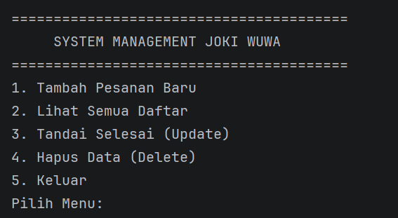

# Laporan Posttest 1 - Pendataan Akun Joki WuWa

**Nama:** Dimas Elang Satria
**NIM:** 2409106027
**Kelas:** PBO A2 2024

---

## Deskripsi Program
Program ini adalah sistem manajemen joki game **Wuthering Waves** berbasis Java. Program ini memungkinkan admin untuk mengelola antrian joki mulai dari pendaftaran akun hingga status penyelesaian.

### Fitur CRUD:
* **Create**: Menambahkan pesanan baru (Username, Password, No HP, Tipe Joki, dan Tingkat Kesulitan).
* **Read**: Menampilkan daftar antrian yang masih aktif dan riwayat yang sudah selesai.
* **Update**: Mengubah status pesanan dari "BELUM" menjadi "SELESAI".
* **Delete**: Menghapus data pesanan dari sistem.

---

## Struktur Class (Nilai Tambah)
Program ini menggunakan 4 Class untuk memisahkan logika data:
1. `Main`: Pusat jalannya program dan menu.
2. `DataJoki`: Menyimpan informasi identitas akun.
3. `Layanan`: Mengelola jenis joki dan detail pesanan.
4. `Harga`: Menentukan nominal harga otomatis berdasarkan tingkat kesulitan.

---

## Dokumentasi Tampilan Program

### Menu Utama

### Tambah Pesanan

### Daftar Pesanan
