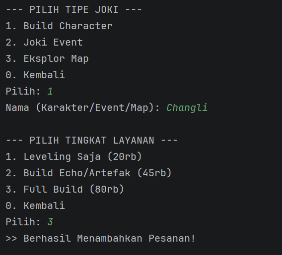
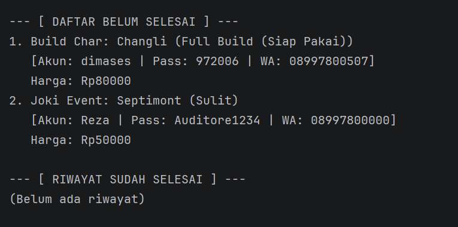
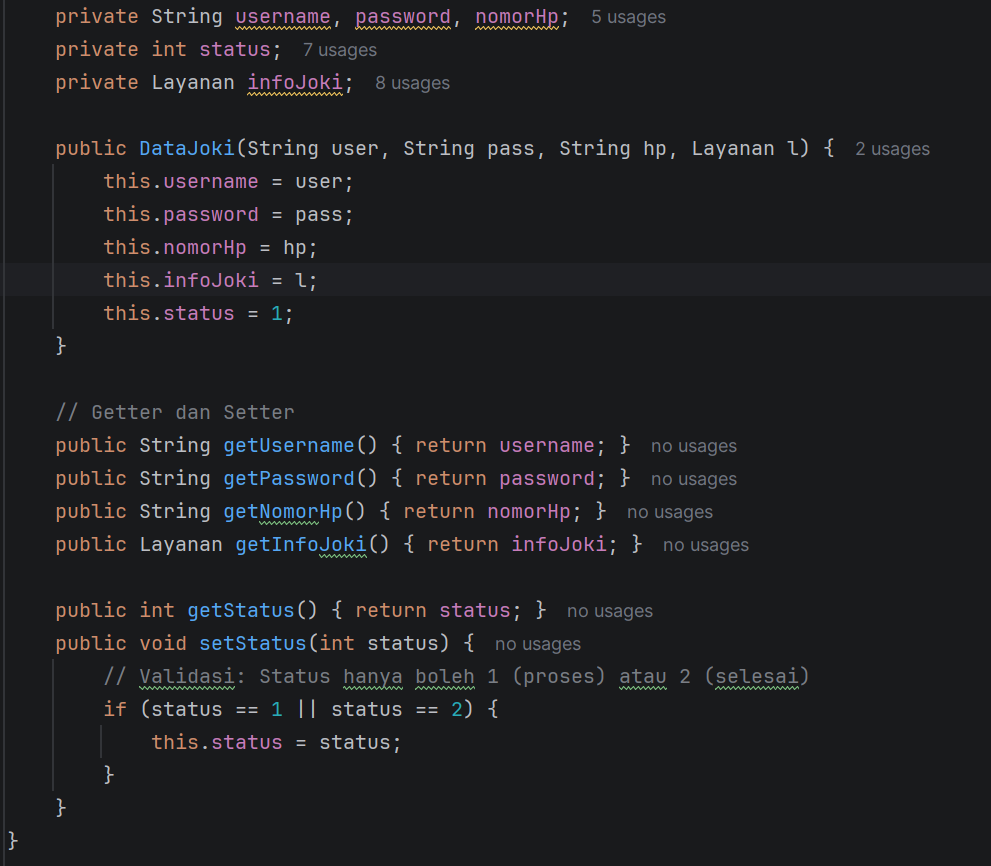
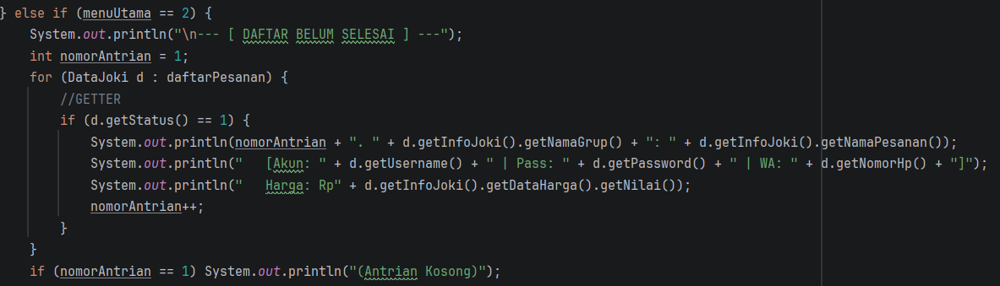
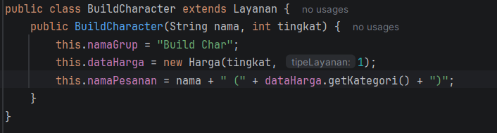

# Laporan Posttest 2 - Encapsulation Joki WuWa

**Nama:** Dimas Elang Satria
**NIM:** 2409106027
**Kelas:** PBO A2 2024

---

## Deskripsi Program
Program ini adalah sistem manajemen joki game **Wuthering Waves** berbasis Java yang memungkinkan admin mengelola antrian joki mulai dari pendaftaran akun hingga status penyelesaian.
Pada **Posttest 2**, program telah menerapkan konsep **Encapsulation** untuk menjaga keamanan data dengan membatasi akses langsung ke atribut menggunakan access modifier `private`, serta penggunaan getter dan setter.
Pada pengembangan selanjutnya (**Posttest 3**), program ditingkatkan dengan menerapkan konsep **Inheritance (Pewarisan)** untuk mengelola jenis layanan joki secara lebih terstruktur. Class `Layanan` dijadikan sebagai superclass, kemudian diturunkan menjadi beberapa subclass sesuai jenis layanan seperti `BuildCharacter`, `JokiEvent`, dan `EksplorMap`. Pendekatan ini membuat kode lebih modular, mudah dikembangkan, dan mengurangi penggunaan percabangan berulang.

### Fitur CRUD:
* **Create**: Menambahkan pesanan baru (Username, Password, No HP, Tipe Joki, dan Tingkat Kesulitan).
* **Read**: Menampilkan daftar antrian yang masih aktif dan riwayat yang sudah selesai.
* **Update**: Mengubah status pesanan menggunakan method **Setter**.
* **Delete**: Menghapus data pesanan dari sistem.

---

## Penerapan Encapsulation
Sesuai dengan prinsip Encapsulation yang dipelajari, perubahan yang dilakukan pada proyek ini meliputi:
1. **Access Modifier**: Mengubah semua atribut/properti class menjadi `private` agar data tersembunyi sepenuhnya dari dunia luar.
2. **Getter**: Menyediakan method `public get` untuk mengambil nilai dari properti di dalam class.
3. **Setter**: Menyediakan method `public set` untuk mengatur atau mengubah nilai property (seperti status pesanan) dengan kontrol yang lebih baik.

---

## Struktur Class
Program ini menggunakan 4 Class untuk memisahkan logika data secara terorganisir:
1. `Main`: Pusat jalannya program, menu, dan interaksi user melalui getter/setter.
2. `DataJoki`: Menyimpan informasi identitas akun (Username, Password, No HP) secara privat.
3. `Layanan`: Mengelola jenis joki dan detail pesanan.
4. `Harga`: Menentukan nominal harga otomatis berdasarkan tingkat kesulitan.

---

## Penerapan Inheritance
Selain encapsulation, program ini juga menerapkan konsep **Inheritance (Pewarisan)** untuk mengelompokkan jenis layanan joki.
Struktur inheritance yang digunakan adalah:
- Layanan (Superclass)
    - BuildCharacter
    - JokiEvent
    - EksplorMap

---

## Dokumentasi Tampilan Program & Kode

### 1. Menu Utama & CRUD

### 2. Output Tambah & Daftar Pesanan

### 3. Implementasi Encapsulation 

### 3. Implementasi Inheritance

